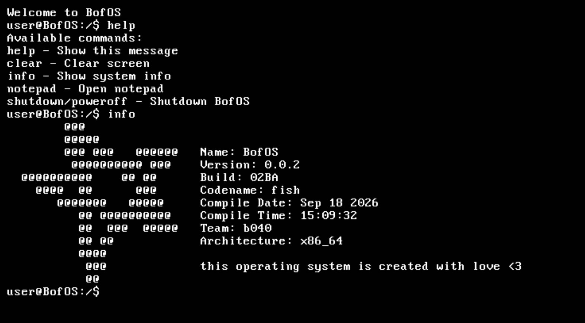

# BofOS - The ZorOS but better
operating system created by Pan or `b040`, it's a fork from the operating system ZorOS but the objective is: Attempt to refactor the code to make it more readable.

## what is it's architecture?
is created with x86_64 architecture, it's a monolithc kernel, it's written in C and Assembly language

use GRUB2 as bootloader (can view `iso/boot/grub/grub.cfg` and `src/boot/multiboot.c` for more info)

## explore the project
``` txt
BofOS/
├── inc/              
│   ├── kernel/
│   ├── drivers/
│   │   ├── hardware/
│   │   ├── interruption/
│   │   └── ...   
│   │
│   ├── app/
│   │   ├── critical/
│   │       ├── commands/
│   │       ├── controllers/
│   │       └── internal/
│   ├── system/
│   │   ├── programs/
│   │   └── ...
├── iso/              
├── src/              
│   ├── app/
│   │   ├── critical/
│   │       ├── commands/
│   │       ├── controllers/
│   │       └── internal/
│   ├── boot/         
│   ├── drivers/ 
│   │   ├── hardware/
│   │   ├── interruption/
│   │   └── ...   
├── CHANGELOG.md      
├── LICENSE.md
└── README.md
```

`inc/` is used for header files, `src/` is used for source files, `iso/` is used for iso files.

## how to build

first you need to install the tools, dependencies and package for building an os from source code (i recommend using Arch Linux or WSL2 for this)

ubuntu and debian:
``` bash
sudo apt update
sudo apt install build-essential nasm qemu-system-x86 grub2-common grub-pc-bin mtools xorriso gcc-multilib g++-multilib
```

now, build the project:
``` bash
# build the project
make

# run the project
make run
```
## how to get more info
- `CONTRIBUTING.md` for more info about contributing and how to use the project
- `CHANGELOG.md` for more info about changes
- `LICENSE.md` for more info about license

## images

